% 使用 Graphviz 绘画 UML 图
% Milo Yip
% 2019/10/28

# 简介

> 本文为开放文档，可在 [GitHub](https://github.com/miloyip/graphvizuml) 提交 issue／PR。本文的 PDF 版本可在 [在此下载](https://miloyip.github.io/graphvizuml/graphvizuml.pdf)。

[Graphviz](https://www.graphviz.org/) 是 AT&T 实验室开发的一个开源软件，它以一种文本语言去描述图（graph），然后自动排布节点和边去生成图片。它已有近 30 年历史。

UML（unified modeling language，统一建模语言）是一种常用的面向对象设计的方法。其中最常用的是类图（class diagram），用于表示类的构成以及类之间的关系。

利用 Graphviz 去生成 UML 类图有几个好处：

1. 用文本表示图，容易更新，容易做版本管理。
2. 能自动排布节点位置，在大型复杂的图特别方便。
3. 统一文档风格。

实际上，文档生成工具[Doxygen](http://www.doxygen.nl/) 也是采用 Graphviz 生成类图的。不过，我们在软件设计中，经常以类图表示系统中某个部分，并且按需展示某些重点，而不是简单地全部列出，所以还是需要手工去描述我们想要画什么，表示我们的软件设计。

## 使用 Graphviz dot

首先，下载 [Graphviz](https://www.graphviz.org/download/) 安装包。macOS 用户可以 `brew install graphviz`。

建立一个测试源文件 `hello.dot`（[DOT语言](https://zh.wikipedia.org/wiki/DOT%E8%AF%AD%E8%A8%80)为 Graphviz 的图形描述语言）：

~~~dot
digraph {
    Hello -> World
}
~~~

在命令行执行：

~~~bash
dot -Tpng hello.dot -o hello.png
~~~

就能生成：

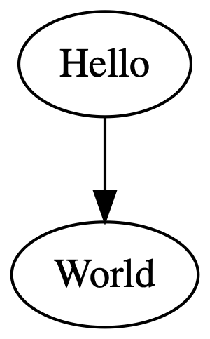

作为程序员，我们可以用常用的 GNU make 去做这个生成，以下的 makefile 也展示生成 PDF 矢量格式：

~~~makefile
DOTFILES = $(basename $(wildcard *.dot))

all: \
    $(addsuffix .png, $(DOTFILES)) \
    $(addsuffix .pdf, $(DOTFILES))

%.png: %.dot
    dot $< -Tpng -o $@

%.pdf: %.dot
    dot $< -Tpdf -o $@
~~~

# 类图

UML 类图（class diagram）是最常见的图，用于表示系统的静态结构。UML 中类是以矩形表示。我们可以在 dot 文件中预设节点的形状，并且设置一些如字体等属性：

~~~dot
digraph {
    node [shape=box, fontname="Inconsolata, Consolas", fontsize=10, penwidth=0.5]

    Foo
    Bar
}
~~~

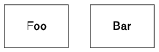

稍后我们再谈如何加入类的成员。

## 继承

继承（inheritance）是类之间很重要的关系，在 UML 中又称其为泛化（generalization）关系，以空心箭头表示派生类指向基类。在 DOT 语言中，可以设置边的箭头形状，不过要注意，通常我们会把基类放在上面，因此我通常会这样设置：

~~~dot
digraph {
    node [shape=box, fontname="Inconsolata, Consolas", fontsize=10, penwidth=0.5]

    Animal, Mammal, Reptile, Dog, Cat, Snake

    /* inheritance */
    {
        edge [arrowtail=onormal, dir=back]

        Animal -> { Mammal, Reptile }
        Mammal -> { Dog, Cat}
        Reptile -> Snake
    }
}
~~~

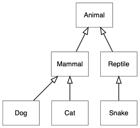

## 关联

UML 中的关联（association）描述两个类的关系，以类之间的实线表示。例如人和杂志的关系是订阅：

~~~dot
digraph {
    node [shape=box, fontname="Inconsolata, Consolas", fontsize=10, penwidth=0.5]

    Person, Magazine

    /* Association */
    {
        edge [dir=none]
        Person -> Magazine [label=" subscribe"]
    }
}
~~~

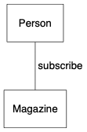

我们经常会表示关联之间的多重性（multiplicity），例如 `Person` 类的实例最多可订阅 5 本杂志，而每本杂志可被任意数目的人订阅：

~~~dot
digraph {
    node [shape=box, fontname="Inconsolata, Consolas", fontsize=10, penwidth=0.5]
    edge [fontname="Inconsolata, Consolas", fontsize=10, penwidth=0.5]

    Person, Magazine

    /* Association with multiplicity */
    {
        edge [dir=none]
        Person -> Magazine [label=" subscribe", headlabel="0..10", taillabel="* "]
    }
}
~~~

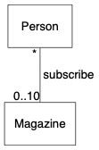

注意，上面的例子在 `label`、`headlabel`、`taillabel` 加入空格避免它们太贴近连线（这不完美）。

关联可以是单向或双向的，以线形箭头表示，无箭头也表示双向关联。以下展示单向关联，面试官知道他对应的候选人，但候选人不知道面试官：

~~~dot
digraph {
    node [shape=box, fontname="Inconsolata, Consolas", fontsize=10, penwidth=0.5]
    edge [fontname="Inconsolata, Consolas", fontsize=10, penwidth=0.5]

    Interviewer, Candidate

    /* Unidirection association */
    {
        Interviewer -> Candidate [arrowhead=vee]
    }
}
~~~

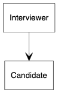

## 聚合

聚合（aggregation）是一种特殊的关系，是一种弱的包含关系，包含方以空心菱形表示。例如，一个部门含有一些员工：

~~~dot
digraph {
    node [shape=box, fontname="Inconsolata, Consolas", fontsize=10, penwidth=0.5]
    edge [fontname="Inconsolata, Consolas", fontsize=10, penwidth=0.5]

    Department, Employeee

    /* Aggregation */
    {
        edge [dir=back, arrowtail=odiamond, headlabel="* "]
        Department -> Employeee
    }
}
~~~

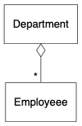

## 组成

组成（composition）是更强的包含关系，说明一个类的实例是另一个类的组成部分，它们有一致的生命周期，组成方以实心菱形表示。例如，一家公司由多个部门组成，若果公司结业，部门也不存在了：

~~~dot
digraph {
    node [shape=box, fontname="Inconsolata, Consolas", fontsize=10, penwidth=0.5]
    edge [fontname="Inconsolata, Consolas", fontsize=10, penwidth=0.5]

    Company, Department, Employeee

    /* Composition */
    {
        edge [dir=back, arrowtail=diamond, headlabel="* "]
        Company -> Department        
    }

    /* Aggregation */
    {
        edge [dir=back, arrowtail=odiamond, headlabel="* "]
        Department -> Employeee
    }
}
~~~

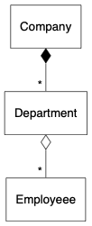

## 依赖

依赖（depedency）关系说明一个类会使用到另一个类，例如表示以一个类作为成员方法的参数或返回值。UML 中采用线形箭头和虚线表示。以下的例子表示工厂创建产品，常见于各种工厂模式，工厂不拥有产品。

~~~dot
digraph {
    node [shape=box, fontname="Inconsolata, Consolas", fontsize=10, penwidth=0.5]
    edge [fontname="Inconsolata, Consolas", fontsize=10, penwidth=0.5]

    Factory, Product

    /* Dependency */
    {
        edge [arrowhead=vee, style=dashed]
        Factory -> Product [label=" <<create>>"]
    }
}
~~~

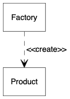

## 类成员

类除了名字，也可以展示其成员。成员包括属性（attribute）和方法（method）。

每个成员的可见性（visibility）以一个前置符号表示：

1. `+` 公有（public）
2. `-` 私有（private）
3. `#` 保护（protected）
4. `~` 包（package）

如果成员为静态（static）的，则加下划线。

属性的格式为：

~~~
<visibility> <attribute name> : <type>
~~~

方法的格式为：

~~~
<visibility> <method name> (<param1 name> : <param1 type>, ...) : <return type>
~~~

Graphviz 可使用 record shape 或 HTML table 来分隔类名字、属性和方法，例如以下的 C++ 类：

~~~cpp
class Account {
public:
    void Deposite(int amount);
    void Withdraw(int amount);
    int GetAmount();
protected:
    int balance;
private:
    string owner;
};
~~~

用 record shape 的话可写作：

~~~dot
digraph {
    node [shape=record, fontname="Inconsolata, Consolas", fontsize=10, penwidth=0.5]

    Account [label="{
Account
|
# balance : int\l
- owner : string\l
|
+ Deposite(amount : int)\l
+ Withdraw(amount : int)\l
+ GetBalance() : int\l
}"]

}
~~~

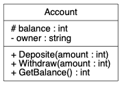

当中，`\l` 是代表该行向左对齐并换行。

如需更多控制，则可使用 HTML table，但就会更冗长：

~~~dot
digraph {
    node [shape=plaintext, fontname="Inconsolata, Consolas", fontsize=10, penwidth=0.5]

    Account [label=<
<table border="0" cellborder="1" cellspacing="0">
<tr><td align="left" balign="left">
# balance : int 
- owner : string 
</td></tr>
<tr><td>Account</td></tr>
<tr><td align="left" balign="left">
+ Deposite(amount : int) 
+ Withdraw(amount : int) 
+ GetBalance() : int 
</td></tr>
</table>
>]

}
~~~

使用 HTML table 可加入 `<U></U>`（下划线）、`<I></I>` （斜体）等字体控制，但只在一些渲染器中有效。如需表示静态或抽像，可利用 stereotype `<<abstract>>`、`<<static>>` 等说明。

再重申一次，类图不必要展示所有细节，可按想表达的意思仅加入部分成员，每个方法也可忽略一些参数细节。

## 包

在比较大的系统里，类通常会用包（package）的方式来组织。Graphviz 不能简单还完 UML 包的图形，但可以使用 subgraph cluster 功能去近似地表示类属于那个包。

例如：

~~~dot
digraph {
    graph [fontname="Inconsolata, Consolas", fontsize=10, penwidth=0.5,
        labeljust=left] 
    node [shape=box, fontname="Inconsolata, Consolas", fontsize=10, penwidth=0.5]
    edge [fontname="Inconsolata, Consolas", fontsize=10, penwidth=0.5]

    subgraph clusterView {
        label="View"
        AccountView, CustomerView
    }
    
    subgraph clusterModel {
        label="Model"
        Account, Customer
    }

    /* Unidirecitonal association */
    {
        edge [arrowhead=vee]
        AccountView -> Account
        CustomerView -> Customer
    }
}
~~~

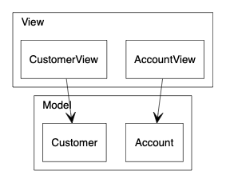

注意，`subgraph` 的名字必须以 `cluster` 为前缀。

## 排布技巧

自动排布固然很方便，但有时候我们想做出一些修改。例如，dot 描述的是有向图，从来源节点指向目标节点时，目标节点就会成为下一级，预设设置下，节点会垂直排列，如以下例子：

~~~dot
digraph {
    node [shape=box, fontname="Inconsolata, Consolas", fontsize=10, penwidth=0.5]

    Canvas, Shape, Rectangle, Circle

    /* Inheritance */
    {
        edge [arrowtail=onormal, dir=back]
        Shape -> { Rectangle, Circle }
    }

    /* Composition */
    {
        edge [dir=back, arrowtail=diamond, headlabel="* "]        
        Canvas -> Shape
    }
}
~~~

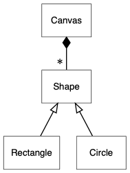

但有时候我们想作一些改动，例如继承沿用这种方式，但关联时则以水平。我们可以使用 `rank=same` 去设置一组节点为同一级，节点之间的距离可整体设置 `nodesep` 属性：

~~~dot
digraph {
    graph [nodesep=1]
    node [shape=box, fontname="Inconsolata, Consolas", fontsize=10, penwidth=0.5]

    {
        rank=same
        Canvas, Shape
    }

    Rectangle, Circle

    /* inheritance */
    {
        edge [arrowtail=onormal, dir=back]
        Shape -> { Rectangle, Circle }
    }

    /* composition */
    {
        edge [dir=back, arrowtail=diamond, headlabel="* "]
        Canvas -> Shape
    }
}
~~~

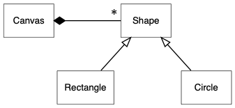

## 颜色

UML 图也不一定是黑白的。做软件设计时可以加入颜色去加入一些意思，例如不同包的类可设置为不同颜色。挑选颜色是一个头痛的问题，可以采用 Graphviz 的配色方案（color scheme）功能。例如用 `colorscheme=spectral7` 设置 7 个光谱色配色方案，然后我们可以用 `fillcolor=1` 至 `7` 去填充节点形状：

~~~dot
digraph {
    graph [fontname="Inconsolata, Consolas", fontsize=10, penwidth=0.5, labeljust=left] 
    node [shape=box, fontname="Inconsolata, Consolas", fontsize=10, penwidth=0.5,
        style=filled, colorscheme=spectral7]
    edge [fontname="Inconsolata, Consolas", fontsize=10, penwidth=0.5]

    subgraph clusterView {
        label="View"
        node [fillcolor=4]
        AccountView, CustomerView
    }

    subgraph clusterModel {
        label="Model"
        node [fillcolor=6]
        Account, Customer
    }

    /* Unidirecitonal association */
    {
        edge [arrowhead=vee]
        AccountView -> Account
        CustomerView -> Customer
    }
}
~~~

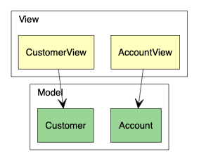

# 状态图

T.B.W.

# 参考

1. Koutsofios, Eleftherios, and Stephen C. North. ["Drawing graphs with dot."]((https://graphviz.gitlab.io/_pages/pdf/dotguide.pdf)) (1996).
2. [Node, Edge and Graph Attributes](https://graphviz.gitlab.io/_pages/doc/info/attrs.html)
3. [Node Shapes](https://graphviz.gitlab.io/_pages/doc/info/shapes.html)
4. [Arrow Shapes](https://graphviz.gitlab.io/_pages/doc/info/arrows.html)

